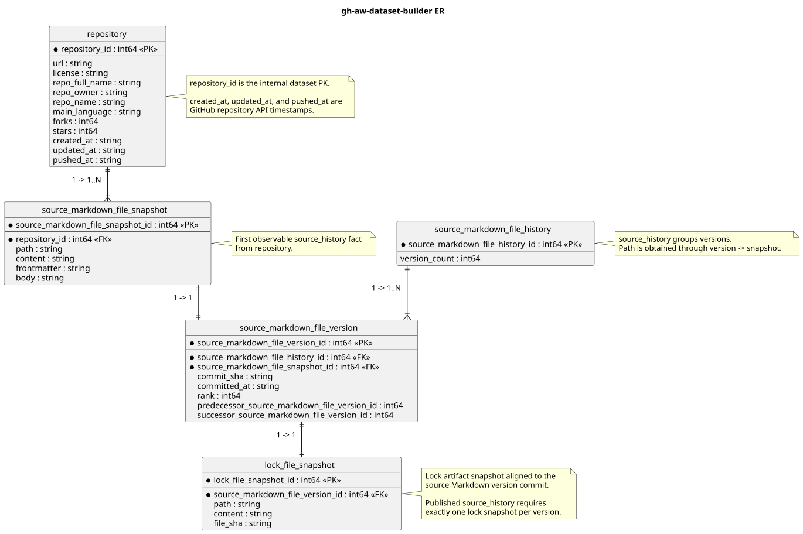

# GHAW-H: GitHub Agentic Workflow Histories

[](https://huggingface.co/datasets/pavtch/GHAW-H)
[](https://pavt.github.io/GHAW-H/)
[](LICENSE)

GHAW-H is a research dataset describing the observable evolution of GitHub Agentic Workflows (GH-AW) in early-adopter open-source repositories. It connects repository metadata with versioned workflow Markdown specifications and their aligned lock-file snapshots.

This public repository is the dataset companion package. It contains documentation, schema material, figures, and executable notebooks. The normalized Parquet tables are hosted on [Hugging Face](https://huggingface.co/datasets/pavtch/GHAW-H); the private collection and construction system is intentionally not distributed here.

## Dataset at a glance

| Repositories | Source histories | Markdown versions | Lock snapshots |
| ---: | ---: | ---: | ---: |
| 262 | 604 | 2,820 | 2,820 |

The published `source_history` profile contains five relational tables:

| Table | Rows | Description |
| --- | ---: | --- |
| `repository` | 262 | GitHub repository metadata observed from the repository API. |
| `source_markdown_file_history` | 604 | Longitudinal grouping for versions of the same GH-AW Markdown file. |
| `source_markdown_file_snapshot` | 2,820 | Immutable observed Markdown states. |
| `source_markdown_file_version` | 2,820 | Ordered positions linking snapshots to commits and histories. |
| `lock_file_snapshot` | 2,820 | Matching `.lock.yml` states recovered at the same commits. |

## Example notebooks

The notebooks download the current dataset directly from `pavtch/GHAW-H`. No GitHub authorization is required.

| Description | Notebook | Open in Colab |
| --- | --- | --- |
| Basic loading and joins | [load_GAWD.ipynb](notebooks/load_GAWD.ipynb) | [Open in Colab](https://colab.research.google.com/github/pavt/GHAW-H/blob/main/notebooks/load_GAWD.ipynb) |
| Dataset overview | [dataset_overview.ipynb](notebooks/dataset_overview.ipynb) | [Open in Colab](https://colab.research.google.com/github/pavt/GHAW-H/blob/main/notebooks/dataset_overview.ipynb) |
| Repository language usage | [language_usage.ipynb](notebooks/language_usage.ipynb) | [Open in Colab](https://colab.research.google.com/github/pavt/GHAW-H/blob/main/notebooks/language_usage.ipynb) |
| File-version histories | [history_data.ipynb](notebooks/history_data.ipynb) | [Open in Colab](https://colab.research.google.com/github/pavt/GHAW-H/blob/main/notebooks/history_data.ipynb) |

## Load a table

```python
import pandas as pd

base = "https://huggingface.co/datasets/pavtch/GHAW-H/resolve/main/data"
repository = pd.read_parquet(f"{base}/repository.parquet")
versions = pd.read_parquet(f"{base}/source_markdown_file_version.parquet")
```

## Schema



The detailed [table dictionary](schema/table_dictionary.md) documents every public field.

## License

The release metadata declares CC BY 4.0. Content originating from source repositories remains subject to the copyright and license terms of those repositories. Users are responsible for checking source-specific terms before redistributing extracted artifacts.

## Citation

Citation metadata is provided in [`CITATION.cff`](CITATION.cff). Paper citation details will be added when available.
